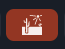
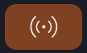

# Onsite setup

This is the one stop shop for everything related to setting up Conjurer. Just followed these 47 easy steps. What could go wrong?

It is assumed that there is no internet at the event.

## Before leaving for the event

### Update Conjurer

1. Run `git pull` to fetch the latest code (or `git clone` this repository)
1. Run `node -v` to ensure you are using node 18
   - For easy node version management, [install `nvm`](https://github.com/nvm-sh/nvm?tab=readme-ov-file#installing-and-updating)
   - Once it is installed, run `nvm install 18`
   - If nvm and node 18 are already installed, simply run `nvm use 18`
   - Run `node -v` again to verify you are using node 18
1. Run `yarn` to install dependencies
1. Run `yarn dev` to run conjurer locally
1. Visit http://localhost:3000 to test it out
   - Note that the first load will be slow

### Setup Conjurer to use local data

> This section needs a rewrite

These steps can be skipped if you will have internet at the event.

1. Run `yarn downloadCloudAssets` to download all cloud assets into the folder `public/cloud-assets`
   - This could take a little bit because there's a bunch of audio to download
   - Note that you are getting a snapshot of all of the experiences and audio files. If anyone makes more changes to these cloud saved files, you will have to rerun this script to download the latest changed assets
2. Run `yarn build` (to be confirmed if this is really necessary)
3. Run `yarn dev` to run conjurer locally if it is not already running
4. Visit the app at http://localhost:3000
5. Toggle the `Use local assets` button (desert icon) on such that it becomes orange:

6. Reload the page.
7. Optionally, verify your setup by turning off your internet and make sure you can load and play experiences still.

You are good to go! From now on, you should not need internet access for any functionality. Whenever you open an experience or audio file, it will be loaded from the local `public/cloud-assets` directory, and whenever you save an experience file, it will be saved locally into that same directory.

You can toggle the same `Use local assets` button again to return to opening/saving files to the cloud. Just be careful of potentially overwriting the wrong thing.

## At the event

### Start up and configure Conjurer

> This section needs a rewrite

1. Run `yarn dev` to run Conjurer locally
1. Visit http://localhost:3000 to tested out
   - Log in as someone, open up an experience
   - Click play and verify visuals and audio are working
1. If you don't have internet, make sure the `Use local assets` button (desert icon) is orange:

4. Set the texture size to 1024 on the bottom right of the canvas (optimizations section for details)

### Transmit data

1. Transmit data from Conjurer to the unity app by clicking the transmit button. It will be orange when it is in transmitting mode:

2. TODO: Unity configuration steps

# Optimizations

- Make sure that the conjurer texture size is set to 1024. To the bottom right of the canopy is a button that will say either 256, 512, or 1024. Click it until it says 1024.
- Make sure the "global intensity" slider (middle right) in conjurer is set to maximum. Use pixlite software for global dimming needs.

# Troubleshooting

Here are some issues we have run into in the past. Add to this list as problems occur!

- **Conjurer opens but there is an error modal.** try logging in or opening a different experience. Because of the janky login situation, you may be in a funky state.
- **The canopy is showing something different from Conjurer.** Make sure that in the unity app, the Conjurer node is in "polarized" mode (to be confirmed)
- ...
