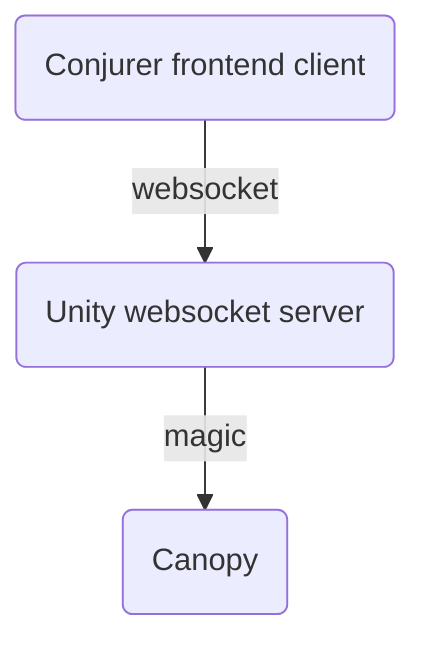

# [Conjurer](https://canopyconjurer.vercel.app)

Conjurer is a web app for designing audiovisual experiences for the [Canopy of Luminous Conjury](https://se.cretfi.re/canopy/), a large LED art piece by [The Servants of the Secret Fire](https://se.cretfi.re/).


## Overview

You can think of Conjurer as an in-browser Digital Audio Visual Workstation, similar to a [Digital Audio Workstation (DAW)](https://en.wikipedia.org/wiki/Digital_audio_workstation). Whereas a DAW is used to arrange and produce audio compositions, Conjurer lets you arrange audio and visuals into an "experience" which can be saved and played at a later time.

## Developing

**Note:** see [Onsite Setup](ONSITE_SETUP.md) for more detailed instructions if preparing for an event.

```bash
# use the correct version of node
nvm use

# install dependencies
yarn

# run the app with hot reloading on save
yarn dev
```

Conjurer should be running locally at http://localhost:3000.

### Tips

- In this repo, patterns/effects at their core are just fragment shaders. They may seem scary at first, but with a proper introduction like in [The Book of Shaders](https://thebookofshaders.com/), you too could wield their considerable power!
- [The shaders page](docs/shaders.md) contains more useful links for learning about shaders.
- See the [How to make a pattern page](docs/patterns.md) if you are interested in creating a pattern or effect of your own!
- We use [Chakra](https://chakra-ui.com/) for our UI in this repo. Check out the [available components here](https://chakra-ui.com/docs/components) as well as the [default theme](https://chakra-ui.com/docs/styled-system/theme)
- We use [MobX](https://github.com/mobxjs/mobx) for state management. It's not Redux!
- We use [ThreeJS](https://threejs.org/) and [React Three Fiber](https://docs.pmnd.rs/react-three-fiber/getting-started/introduction) to render the shaders/3D canopy.
- We use [`react-icons`](https://react-icons.github.io/react-icons/search). Just search for what you want and import the icon from the correct place using the 2-letter prefix.
- We use [`recharts`](https://recharts.org/en-US/api) to do some simple graphs.
- We use [`wavesurfer.js`](https://wavesurfer-js.org/) for all of our audio needs.

### Concepts

- Pattern
  - A fragment shader that generates a texture (an image) based purely on parameters (uniforms)
  - This texture can either be rendered directly to the canopy or passed to an effect
- Effect
  - A fragment shader that accepts a texture and applies an effect based purely on parameters, outputting a new texture
  - Just like a pattern, this texture can either be rendered directly to the canopy or passed to an effect
  - Note: Identical to patterns, except that effects accept a texture as an input
- Parameter
  - This is a value that tweaks what is being generated by a pattern/effect
  - "Color", "Fuzziness", "Radius" for example
- Parameter variations
  - Changes over time applied to a pattern/effect parameter
  - "Change the color from blue to green over 5 seconds"

### Architecture

Here is the zoomed out view of the architecture. Frame data is sent over websocket to the Unity app's websocket server. Ultimately this data is piped to the canopy and the canopy displays that frame.



### Pages

- https://canopyconjurer.vercel.app/ - main page where experiences can be edited and viewed
- https://canopyconjurer.vercel.app/viewer - view-only page
- https://canopyconjurer.vercel.app/portal - view-only page that tells a story
- https://canopyconjurer.vercel.app/playground - page for tinkering with patterns+effects, can be used to VJ
- https://canopyconjurer.vercel.app/controller - controller page can control playground page (requires running controllerServer)
- https://canopyconjurer.vercel.app/beatMapper - page for constructing a beat map for a song

### Scripts

#### `yarn generatePattern PatternName`

Generates boilerplate for a new pattern called PatternName. Choose your own unique PatternName. It prints out the filepaths it writes, including the fragment shader and typescript pattern definition.

#### `yarn controllerServer`

Starts the server that passes messages between conjurer and conjurer controllers.

#### `yarn generateCanopy`

Generates canopy geometry data and stores it in `src/data/canopyGeometry.json`.

#### `yarn unityTestServer`

Starts a websocket server at port 8080 on localhost. For development use only, to mock the websocket server that the Unity app would run. Writes `src/scripts/output.png` once per second.

#### `yarn downloadCloudAssets`

Downloads all of the experience and audio files from s3 into the folder `public/cloud-assets`. Conjurer can then read from these files when in "local asset mode", useful for situations when internet is not available. See section below for more details.

#### `ANALYZE=true yarn build`

Use webpack analyzer to analyze the bundle. Will launch three tabs in your browser with bundle size details.

### Setting up Conjurer Playground to run via Controller

1. Find your local IP address, and set `CONTROLLER_SERVER_WEBSOCKET_HOST` (`websocketHost.ts`) to that address.
1. Run `yarn dev`, or `yarn build && yarn start`.
1. Run `yarn controllerServer`.
1. Open http://localhost:3000/playground.
1. On any device on the network, visit http://<IP_ADDRESS>:3000/controller.

You are good to go - when you change things with the controller, you should see the playground page update.

## Todos

To dos are captured in the [wiki](https://github.com/SotSF/conjurer/wiki), and occasionally are captured as issues.

## Contributing

Please do! This is a group effort, and any help is welcome.
