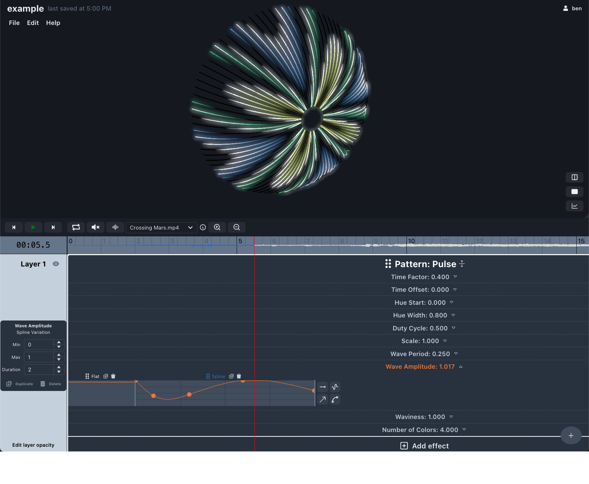
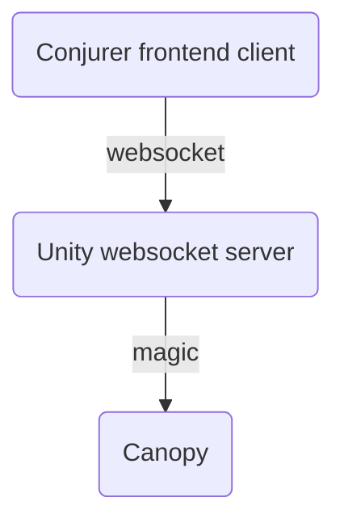

# [Conjurer](https://canopyconjurer.vercel.app)

Conjurer is a web app for designing audiovisual experiences for the [Canopy of Luminous Conjury](https://se.cretfi.re/canopy/), a large LED art piece by [The Servants of the Secret Fire](https://se.cretfi.re/).



## Overview

You can think of Conjurer as an in-browser Digital Audio Visual Workstation, similar to a [Digital Audio Workstation (DAW)](https://en.wikipedia.org/wiki/Digital_audio_workstation). Whereas a DAW is used to arrange and produce audio compositions, Conjurer lets you arrange audio and visuals into an "experience" which can be saved and played at a later time.

## Developing

**Note:** see [Onsite Setup](ONSITE_SETUP.md) for more detailed instructions if preparing for an event.

```bash
# use the correct version of node
nvm use

# install dependencies
yarn

# run the app with hot reloading on save
yarn dev
```

Conjurer should be running locally at http://localhost:3000.

### Database access

Note that you will be using a local database by default. The SQLite database will be generated automatically if it does not exist (`setupDatabase.sh`) at `./local.db`.

In production we use [Turso](https://docs.turso.tech/introduction), which cloud hosts SQLite/LibSQL databases. If you would like production database access, you will need to define `TURSO_DATABASE_URL` and `TURSO_AUTH_TOKEN` in `.env.local`:

```
TURSO_DATABASE_URL=libsql://conjurer-db-secretfire.turso.io
TURSO_AUTH_TOKEN=******************************
```

Ask for credentials to the Turso dashboard to generate your own token.

### General info / tips

- In this repo, patterns/effects at their core are just fragment shaders. They may seem scary at first, but with a proper introduction like in [The Book of Shaders](https://thebookofshaders.com/), you too could wield their considerable power!
- [The shaders page](docs/shaders.md) contains sum useful links for learning about shaders.
- See the [How to make a pattern page](docs/patterns.md) if you are interested in creating a pattern or effect of your own!
- We use [Chakra v2](https://chakra-ui.com/) for our UI in this repo. Check out the [available components here](https://v2.chakra-ui.com/docs/components) as well as the [default theme](https://v2.chakra-ui.com/docs/styled-system/theme)
- We use [MobX](https://github.com/mobxjs/mobx) for state management. It's not Redux!
- We use [ThreeJS](https://threejs.org/) and [React Three Fiber](https://docs.pmnd.rs/react-three-fiber/getting-started/introduction) to render the shaders/3D canopy. In practice, you won't need to understand these libraries unless you are changing something like the rendering pipeline.
- We use [`react-icons`](https://react-icons.github.io/react-icons/search). Just search for what you want and import the icon from the correct place using the 2-letter prefix (check out other examples in this repo).
- We use [`recharts`](https://recharts.org/en-US/api) to do some simple graphs for parameter variations.
- We use [`wavesurfer.js`](https://wavesurfer-js.org/) for all of our audio needs.
- We use [Turso](https://docs.turso.tech/introduction) to host our production database along with [Drizzle ORM](https://orm.drizzle.team/docs/overview).
- When running conjurer locally, we instead use a local SQLite database file (`./local.db`). You can run `yarn db:local:studio` to poke around the database via web UI to learn our data models.
- We use [tRPC](https://trpc.io/docs/), which lets you do remote procedure calls (RPCs) from the client to the server. That means you can just write a javascript function in a router file `/src/server/routers/*Router.ts` and then call it from the client. The rest is abstracted away, so no need to fetch etc.

### Concepts

- Pattern
  - A fragment shader that generates a texture (an image) based purely on parameters
  - This texture can either be rendered directly to the canopy or passed to an effect
- Effect
  - A fragment shader that accepts a texture and applies an effect based purely on parameters, outputting a new texture
  - Just like a pattern, this texture can either be rendered directly to the canopy or passed to an effect
  - Note: Identical to patterns, except that effects additionally accept a texture as an input
- Parameter
  - This is a value that tweaks what is being generated by a pattern/effect
  - A parameter can represent any arbitrary aspect of the pattern that we want
  - "Color", "Fuzziness", "Radius" for example
- Parameter variations
  - Changes over time applied to a pattern/effect parameter
  - "Change the color from blue to green over 5 seconds"
  - "Change the wave amplitude from 0 to 1 with an easing function over 1 second"

### Data flow

Here is the zoomed out view of the data flow when conjurer is hooked up to the canopy IRL. Frame data is sent over websocket to the Unity app's websocket server. Ultimately this data is piped to the canopy and the canopy displays that frame.



### Pages

- [/](https://canopyconjurer.vercel.app/) - main page where experiences can be edited and viewed
- [/viewer](https://canopyconjurer.vercel.app/viewer) - view-only page
- [/portal](https://canopyconjurer.vercel.app/portal) - view-only page that tells a story
- [/playground](https://canopyconjurer.vercel.app/playground) - page for tinkering with patterns+effects, can be used to VJ
- [/controller](https://canopyconjurer.vercel.app/controller) - controller page can control playground page (requires running controllerServer)
- [/beatMapper](https://canopyconjurer.vercel.app/beatMapper) - page for constructing a beat map for a song (work in progress)
- [/test](https://canopyconjurer.vercel.app/test) - test page for the embedded Conjurer viewer

### Scripts

#### `yarn generatePattern PatternName`

Generates boilerplate for a new pattern called PatternName. Choose your own unique PatternName. It prints out the filepaths it writes, including the fragment shader and typescript pattern definition.

#### `yarn controllerServer`

Starts the server that passes messages between conjurer and conjurer controllers.

#### `yarn generateCanopy`

Generates canopy geometry data and stores it in `src/data/canopyGeometry.json`.

#### `yarn unityTestServer`

Starts a websocket server at port 8080 on localhost. For development use only, to mock the websocket server that the Unity app would run. Writes `src/scripts/output.png` once per second.

#### `ANALYZE=true yarn build`

Use webpack analyzer to analyze the bundle. Will launch three tabs in your browser with bundle size details.

### Setting up Conjurer Playground to run via Controller

1. Find your local IP address, and set `CONTROLLER_SERVER_WEBSOCKET_HOST` (`websocketHost.ts`) to that address.
1. Run `yarn dev`, or `yarn build && yarn start`.
1. Run `yarn controllerServer`.
1. Open http://localhost:3000/playground.
1. On any device on the network, visit http://<IP_ADDRESS>:3000/controller.

You are good to go - when you change things with the controller, you should see the playground page update.

### Performance issues / memory leaks

This is a big React app, hastily designed, that's doing a lot of expensive CPU/GPU things, so it has been difficult to keep it running smoothly. Here are some random thoughts associated with performance:

- You may encounter some memory leaks related to the hot module reloading/fast refresh when running the app locally. Just reloading or even hard reloading the tab in firefox doesn't free all of the used memory in my experience, so for the best results, if you have been changing code and the app has been hot reloading, you should periodically close the tab and open a new one.
- Memory leaks are apparently much easier to accomplish in React than I realized: https://schiener.io/2024-03-03/react-closures
- Careful with setTimeout chains/setInterval. Make sure there is a way to clean them up on hot reloads. useEffect is a good way to do this.
- If the app slows down a bunch, use the browser profiler to identify where it's spending time. If it's spending time in the garbage collector/cycle collector, it's likely a memory leak issue. At the time of writing, running locally with devtools open the app should use about 1GB of memory.

### Deploying

We host Conjurer on Vercel. Vercel does not allow you to deploy an organization repo like `sotsf/conjurer` on their free hobby tier. So instead, we deploy `brollin/conjurer`. It is an exact copy of the `sotsf/conjurer` repo,

To deploy, all you have to do is to push a new commit to the `main` branch of the `brollin/conjurer` repo. First you will need to be a collaborator on the `brollin/conjurer` repo, so just ask Ben for that.

For ease, you can clone `sotsf/conjurer`. Then you can set up a new remote called `prod` to point at `brollin/conjurer`:

```
git remote add prod ssh://git@github.com/brollin/conjurer.git
```

And then to deploy would just look like:

```
git push prod
```

## Todos

To dos are captured as issues. Feel free to poke around the open issues, ask questions, and open a PR if you feel so inclined.

## Contributing

Please do! This is a group effort, and any help is welcome. Feature ideas or bug reports via issues would be great.
